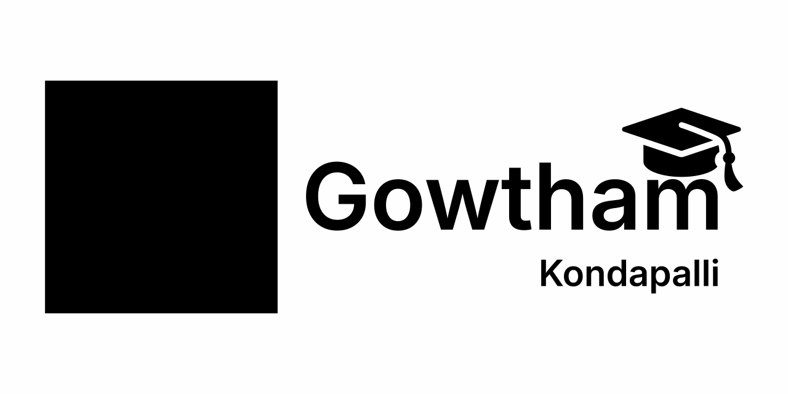

# Gowtham Kondapalli | Portfolio



[](License.txt)

## 🚀 Features

- **Modern Design**: Clean, professional UI with glassmorphism effects and smooth animations
- **Responsive Layout**: Optimized for desktop, tablet, and mobile devices
- **Interactive Timeline**: Horizontal snake timeline for education (desktop) and vertical stack (mobile)
- **One-Time Loading Animation**: Engaging GIF animation that plays only on first visit
- **Smooth Scrolling**: Seamless navigation between sections
- **Dark Theme**: Eye-friendly dark color scheme

## 🛠️ Tech Stack

- **React** - UI library
- **Vite** - Build tool and dev server
- **CSS Variables** - Dynamic theming
- **LocalStorage** - First-time visitor detection

## 📋 Sections

1. **Hero** - Introduction with profile picture and call-to-action
2. **About** - Skills showcase with photography, business, and technical expertise
3. **Experience** - Professional timeline
4. **Education** - Interactive timeline with college logos
5. **Projects** - Portfolio of work including publications
6. **Contact** - Get in touch links

## 🎨 Design Features

- Custom loading screen with GIF animation (first visit only)
- Gradient text effects
- Card-based layouts with hover effects
- Responsive spacing system
- Timeline visualizations
- Glassmorphism header

## 🚦 Getting Started

### Prerequisites

- Node.js (v14 or higher)
- npm or yarn

### Installation

```bash
# Clone the repository
git clone https://github.com/gowtham2thrive/Gowtham-Kondapalli.git

# Navigate to project directory
cd Gowtham-Kondapalli

# Install dependencies
npm install

# Start development server
npm run dev
```

### Build for Production

```bash
npm run build
```

The optimized build will be in the `dist` folder.

## 📱 Responsive Design

- **Desktop** (>1024px): Full horizontal timeline, 3-column skill grid
- **Tablet** (768px-1024px): Adjusted spacing, 2-column layouts
- **Mobile** (<768px): Vertical stacking, optimized touch targets

## 🎯 Key Components

- `LoadingScreen.jsx` - One-time animated intro
- `Hero.jsx` - Landing section with CTA
- `Education.jsx` - Timeline with college logos
- `Experience.jsx` - Professional timeline
- `Projects.jsx` - Portfolio showcase
